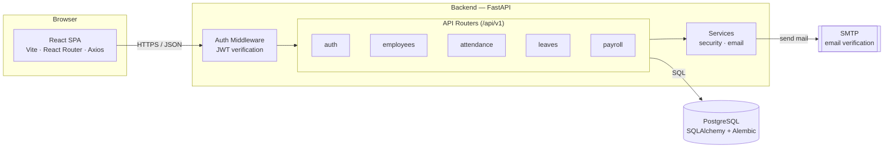

# Dayflow

Dayflow is a Human Resource Management System (HRMS) for growing companies — employee records, attendance, leave, and payroll in one system instead of five spreadsheets.

## Features

- **Authentication** — registration with email verification (JWT-based), login, role-based access (Employee / Admin)
- **Employee Management** — a searchable, filterable employee directory with profiles, departments, designations, and reporting lines
- **Attendance** — daily check-in/check-out with weekly and team-wide views
- **Leave** — employees apply for leave; HR approves or rejects with a comment
- **Payroll** — transparent salary structures; employees view their breakdown, HR manages it centrally

## Architecture



**Request flow:** the React SPA calls the FastAPI backend over JSON; every protected route resolves the caller's identity from a JWT bearer token, then reads or writes through SQLAlchemy models to PostgreSQL (schema managed by Alembic migrations). Registration triggers a verification email sent via SMTP.

## Tech stack

| Layer | Technology |
|---|---|
| Frontend | React, TypeScript, Vite, React Router, Tailwind CSS, Axios |
| Backend | FastAPI, SQLAlchemy, Pydantic, Alembic |
| Database | PostgreSQL |
| Auth | JWT (python-jose), bcrypt password hashing |
| Email | SMTP (smtplib) |

## Project structure

```
Dayflow/
├── backend/
│   ├── app/
│   │   ├── api/routes/     # auth, employees, attendance, leaves, payroll
│   │   ├── core/           # config, security, dependencies
│   │   ├── models/         # SQLAlchemy models
│   │   ├── schemas/        # Pydantic request/response schemas
│   │   ├── services/       # email
│   │   └── database.py
│   ├── alembic/            # database migrations
│   └── tests/
├── frontend/
│   └── src/
│       ├── api/            # typed API client functions
│       ├── components/     # layout + reusable UI primitives
│       ├── context/        # auth & toast providers
│       ├── features/       # feature modules (e.g. employees)
│       ├── pages/           # route-level pages
│       └── routes/         # route guards
└── SETUP.md                # detailed local setup guide
```

## Getting started

See [SETUP.md](SETUP.md) for full setup instructions (database, environment variables, SMTP configuration). Quick version:

```bash
# Backend
cd backend
python3 -m venv .venv && source .venv/bin/activate
pip install -r requirements.txt
cp .env.example .env   # then edit DATABASE_URL / JWT_SECRET_KEY
alembic upgrade head
python run.py           # http://localhost:8000/api/v1/docs

# Frontend
cd frontend
npm install
npm run dev              # http://localhost:5173
```

## API overview

All endpoints are prefixed with `/api/v1`. Interactive docs are available at `/api/v1/docs` once the backend is running.

| Resource | Endpoints |
|---|---|
| Auth | `POST /auth/register`, `POST /auth/verify-email`, `POST /auth/login`, `GET /auth/me` |
| Employees | `GET/PUT /employees/me`, `GET /employees`, `GET/PUT/DELETE /employees/{id}` |
| Attendance | `POST /attendance/check-in`, `POST /attendance/check-out`, `GET /attendance/me`, `GET /attendance/all` |
| Leave | `POST /leaves`, `GET /leaves/me`, `GET /leaves`, `PUT /leaves/{id}/approve`, `PUT /leaves/{id}/reject` |
| Payroll | `GET /payroll/me`, `GET /payroll`, `PUT /payroll/{id}` |
